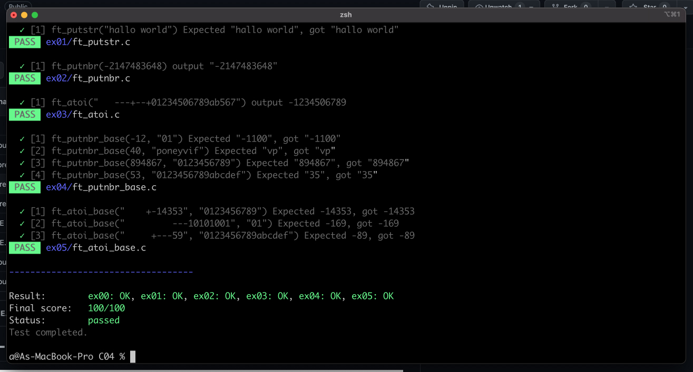

# Mini-moulinette


Mini-moulinette is a test runner for 42 assignments, providing automated tests for whole assignment with one command. The goal is to make thorough checking before submitting the assignments, with ease.


## Introduction

This is now day 11 of piscine. I have wasted so many hours getting evaluated, doing evaluation, waiting for evaluation, only to come back redoing it again because I kept making silly mistakes. I wish I can check my code thoroughly before submitting, but that too, will take a lot of my time. This is why I build this so I can stop wasting my time and many others, and shut moulinette up with just a single submission.


## How Does It Work?



- Mini moulinette runs through all the tests cases automatically, and checks if the test conditions are met.
- It will then output the result.
- The scores are based on 42's practice, where if easier/earlier questions are incorrect, the rest won't count.


# Updating

Mini moulinette is updated daily, to update:

```bash
cd ~/mini-moulinette
```

```bash
git pull
```


## Get Started

> ***Warning***
> Mini moulinette is not 100% accurate, the tests may not cover every edge cases like moulinette. Use with caution.

1. Go to your root `~` directory.

```bash
cd ~
```


2. Clone the git there.

```bash
git clone https://github.com/khairulhaaziq/mini-moulinette.git
```


3. Now create an alias for it.

- zsh:

```zsh
echo "alias mini='~/mini-moulinette/mini-moul.sh'" >> ~/.zshrc && source ~/.zshrc
```

- bash:

```bash
echo "alias mini='~/mini-moulinette/mini-moul.sh'" >> ~/.bashrc && source ~/.bashrc
```


4. Go to your assignment directory where you want to test: e.g: C02 directory

```bash
cd C02
```


5. Run using command `mini` with assignment number as argument. e.g: C02.

```bash
mini C02
```

e.g: C03

```bash
mini C03
```

6. You can now run it for every assignment directory, where tests are provided. Have fun!

## Debugging

The error/success messages should be explicit enough. However sometimes you will get segmentation fault or your code doesn't compile

### If your code doesn't compile

- Check the headers
- Check if it contains main inside
- Check if your function name is similar to a function from standard library, if it is then it will have problem

### If you receive segmentation fault

- You need to find the test cases, go here:

```bash
cd ~/mini-moulinette/mini-moul/tests
```

The current directory contains all the test cases. Every test is in the file that is the same name as the function/program it is testing, e.g. C05/ex00/ft_iterative_factorial.c will contain test for C05 > ex00 > ft_iterative_factorial.c.

The test cases are usually put in a list of array in this structure, e.g. for ft_iterative_factorial test:

``` C
 t_test tests[] = {
        {
            .desc = "Factorial of 0",
            .n = 0,
            .expected = 1,
        },
        {
            .desc = "Factorial of 1",
            .n = 1,
            .expected = 1,
        },
        {
            .desc = "Factorial of 2",
            .n = 2,
            .expected = 2,
        },
        {
            .desc = "Factorial of 10",
            .n = 10,
            .expected = 3628800,
        },
        {
            .desc = "Factorial of a negative number",
            .n = -5,
            .expected = 0,
        },
 }
```


## Customizing

See the above, you can add more tests here. You need to manage your customization yourself when you pull for updates though.


## Status

| Assignment            | Coverage                   | Accuracy         | Remarks         |
| :-------------------- | :------------------------: | :--------------: | :-------------- |
| C00                   | 9/9                        | Not yet rated    |                 |
| C01                   | 9/9                        | Not yet rated    |                 |
| C02                   | 12/13                      | Not yet rated    |                 |
| C03                   | 6/6                        | Not yet rated    |                 |
| C04                   | 6/6                        | Not yet rated    |                 |
| C05                   | 8/9                        | Not yet rated    | ex05, ex06, ex07 tests doesn't cover all edge cases |
| C06                   | 4/4                        | Not yet rated    |                 |
| C07                   | 6/6                        | Not yet rated    | ex02, ex03 tests doesn't cover all edge cases |
| C08                   | 6/6                        | Not yet rated    | every tests mostly just cover compilation |
| C09                   | 0/3                        | Not yet rated    | WIP             |
| C10                   | 0/4                        | Not yet rated    | WIP             |
| C11                   | 0/8                        | Not yet rated    | WIP             |
| C12                   | 0/18                       | Not yet rated    |                 |
| C13                   | 0/8                        | Not yet rated    |                 |


## Contributing

We welcome contributions to mini-moulinette! Here are a few ways you can help out:

- Testing: We rely on community feedback to ensure our tests are comprehensive and accurate. If you notice an error in one of our tests or have an idea for a new test case, please let us know! You can contact us via email at [email address] or on Discord at [Discord username]. We would greatly appreciate any feedback or suggestions you have.
- Code: If you're interested in contributing to the codebase itself, we'd be happy to review any pull requests you submit. We have a few guidelines to ensure that our code is readable and maintainable, so please take a look at our contributing guidelines before you get started.
- Features: Do you have an idea for a new feature that you think would be useful for mini-moulinette? We'd love to hear it! Please create an issue on our GitHub repository to start a discussion.
- Feedback: If you've used mini-moulinette and have some feedback or suggestions for improvement, please let us know! Your input is valuable to us, and we're always looking for ways to make our test runner better.

When contributing to mini-moulinette, please be sure to follow our code of conduct and our guidelines for submitting contributions. Thank you for your interest in our project, and we look forward to working with you!


## Authors

[Khairul Haaziq](https://github.com/khairulhaaziq)


## Contributors

[chatGPT](ai.com)


## License

MIT. Copyright 2023 [Khairul Haaziq](https://github.com/khairulhaaziq).
